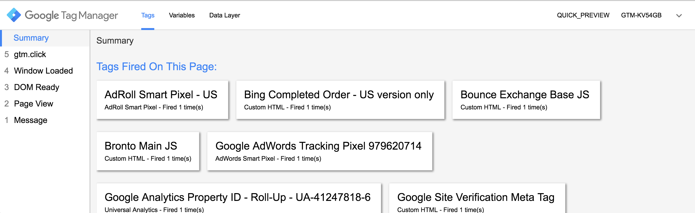

# Google Tag Manager (GTM) and its dataLayer

GTM is "a tool to manage marketing trackers and analytics without rebuilding your application".
In Fame's case, without the need of redeploying the application.

To help you better understand what is GTM and its internal workings, please refer to:

- Original Docs: https://developers.google.com/tag-manager
- Simo Ahava's Blog (GTM and dataLayer tips): https://www.simoahava.com/category/gtm-tips/

## Usage

As a rule of thumb, think on GTM as your main tool to not pollute application templates with volatile marketing trackers.
Its possible usage can include:

- Marketing wants to add a new tracking pixel on specific pages
- A new tool is being introduced to help website remarketing/tracking
- JS based development tools for UX, like HotJar
- JS based website verification codes

## dataLayer

GTM's dataLayer is a JS array where GTM is able to read information from.
It can receive multiple pushes through page lifecycle or user interaction, being able to render tags with dynamic information as needed.

Pushing information to the `dataLayer` consists on pushing a JSON object each time you call a new `dataLayer` event. Example:

```js
dataLayer.push({ 'event': 'event_name', 'user': { name: 'John Doe', email: 'john@doe.com' } });
```

Keep in mind: the `dataLayer` object is loaded on page load time and variables are passed through further events (as DOM ready, window load, etc), as seem below:



If you want to trigger several tags on page load time, you should render the `dataLayer` populated with the desired JSON from the server side.

## Fame's dataLayer

Fame & Partners has a rich `dataLayer` setup, populating GTM with page, product and order information.

> If you wish to have a deeper background on how the `dataLayer` idea was developed,
> its initial setup and configuration started on [PR #694](https://github.com/fameandpartners/website/pull/694)

Fame's `dataLayer` consists on a "container", where it can be appended any "contained GTM presenter", safely rendering them as JSON.
More information about the GTM container, refer to the `Marketing::Gtm::Presenter::Container` and `Marketing::Gtm::Controller::Container` objects.

The container allows any template rendering a JSON with ease (e.g.: `dataLayer.push(<%= @gtm_container.to_json %>);`).
It is safe to assume the container will never raise errors, since it always rescues exceptions into its container, making it possible to be present
on all website pages without raising 500 errors.

## The GTM Container Presenter

A GTM container acts as an array, making it possible having multiple presenters configured at its initialization or appended afterwards.

- Initialization

```ruby
Marketing::Gtm::Presenter::Container.new(presenters: [user_presenter, device_presenter])
```

- Appending

```ruby
@gtm_container = Marketing::Gtm::Presenter::Container.new
@gtm_container.append(user_presenter)
@gtm_container.append(device_presenter)
```

## Creating a GTM Presenter

As a base premise, a GTM presenter object will need to:

- Inherit from `Marketing::Gtm::Presenter::Base`
- Implement the `#key` and `#body` instance methods
    - `#key` method: it will render the JSON object key
    - `#body` method: will render the JSON object body

Example:

```ruby
module Marketing
  module Gtm
    module Presenter
      class Foo < Base
        def key
          'foo'
        end

        def body
          'bar'
        end
      end
    end
  end
end
```

When appended to (or initialized with) the GTM container instance, the `gtm_container.to_json` method will produce the following HTML safe output:

```json
  {"foo": "bar"}
```

## GTM Presenters at the view

GTM Presenters are rendered at the view through controller concerns and a `ApplicationController` instance variable called `@gtm_container`
(More information at the `Marketing::Gtm::Controller::Container` concern and its inclusion at the `ApplicationController`).

After the GTM container is made available to the view and its presenters properly initialized/appended, you are free to render
its JSON format (`@gtm_container.to_json`) at the view. In this project, this is being rendered at the `views/google_tag_manager/_base.html.erb` partial.
